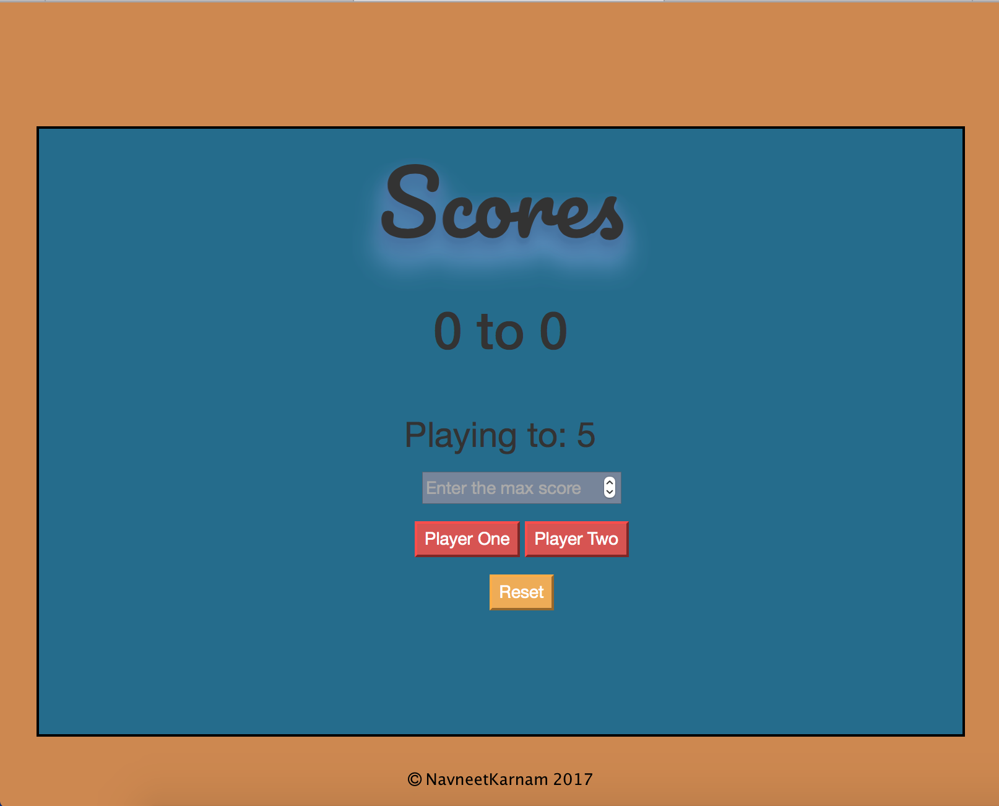
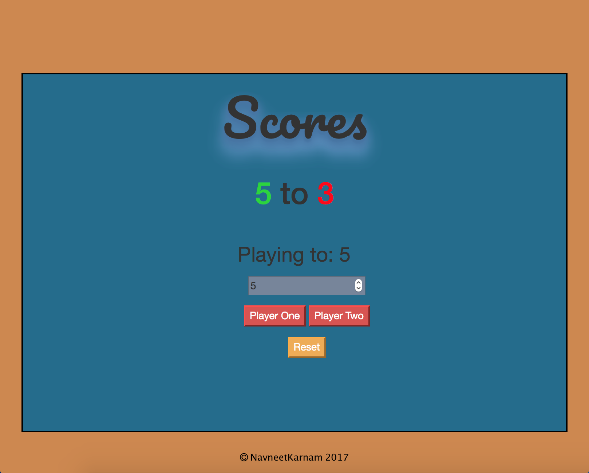

# Score APP 
v2.0
* Simple Score keeping web application
* * * 

- This is a simple web application which is designed to keep track of the scores in any game between two players!
- The maximum winning score can be updated on the given input box.
- Once the maximum score is reached the score of the winning player turns green and similarly the loosing player score turns red!
- The reset button can be used at any point to reset the values back to zero!

* * * 

 

* * *

